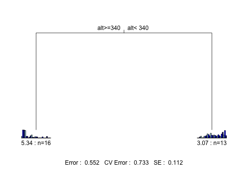
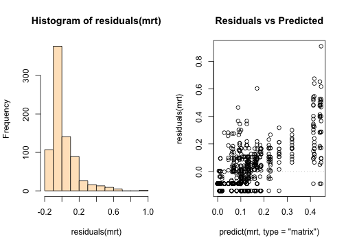
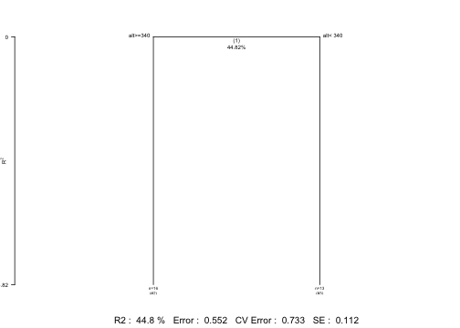
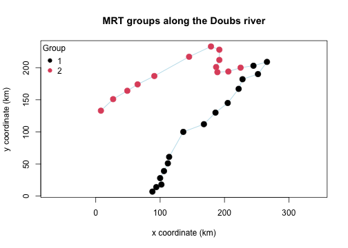

## Introduction

This vignette walks through a complete multivariate regression tree (MRT) analysis, from raw data to interpreted result, using `mvpart` and its companion package `MVPARTwrap`.

The general approach follows the presentation of MRT in Borcard, Gillet & Legendre's *Numerical Ecology with R* (2nd edition, Springer, 2018), Section 4.11 — readers wanting a deeper treatment of the method, its assumptions, and its place among other clustering and ordination techniques should consult that book directly.

## Packages


``` r
library(mvpart)
library(ade4)
library(vegan)
```

## The data

We use the Doubs river fish dataset (Verneaux 1973), a classic dataset in numerical ecology consisting of fish abundances, environmental variables, and spatial coordinates for sites along the Doubs river (France/Switzerland border). It's conveniently bundled with the `ade4` package.


``` r
data(doubs, package = "ade4")

spe <- doubs$fish   # species (fish) abundance data
env <- doubs$env    # environmental variables
xy  <- doubs$xy     # spatial coordinates of the sites
```

One site (site 8) has no fish at all and is dropped in this example.


``` r
spe <- spe[-8, ]
env <- env[-8, ]
xy  <- xy[-8, ]
```

We then normalize the species abundances, a standard step before fitting an MRT on community composition data (Legendre & Gallagher 2001). 

Indeed, `mvpart` builds its tree by minimizing a sum-of-squares criterion, which is geometrically equivalent to Euclidean distance between sites. The problem is that Euclidean distance on raw abundances is a poor ecological measure: it's dominated by highly abundant species, and it can treat two sites sharing no species at all as "similar" simply because their total abundances happen to be alike (the classic "double-zero" problem).

The standard fix (Legendre & Gallagher 2001) is to transform the data beforehand so that ordinary Euclidean distance on the transformed data corresponds to an ecologically meaningful distance. For the chord distance specifically:


``` r
# Chord transformation
spe.chord <- decostand(spe, "normalize")
```

An alternative, and equally common, choice is the **Hellinger transformation**, which uses the square root of relative (rather than raw) abundances:


``` r
# Hellinger transformation (alternative to the chord transformation; not used further below)
spe.hel <- decostand(spe, "hellinger")
```

Both the chord and Hellinger transformations were originally proposed by Legendre & Gallagher (2001) to make Euclidean-distance-based methods (like MRT, PCA, or RDA) ecologically meaningful for community composition data. Both transformations belong to the broader **Box-Cox-chord family** of transformations (Legendre & Borcard 2018), which generalizes the chord transformation by first applying a Box-Cox power transformation to the raw abundances before normalizing to the chord distance. In this framework, the Hellinger transformation corresponds to the specific case of a square-root power transformation (exponent 0.5). The Hellinger transformation is often preferred when a somewhat stronger down-weighting of highly dominant species is desired, owing to its square-root step, or when one wants to remove differences in total abundance across sites, since it works on relative rather than absolute abundances. Either transformation is a reasonable default choice. This vignette continues with the chord-transformed data (`spe.chord`), for consistency with the example from Borcard, Gillet & Legendre's *Numerical Ecology with R* (2nd edition, Springer, 2018).

## Fitting the MRT

`mvpart` extends `rpart`'s single-response regression tree to a multivariate response: instead of splitting on the variance of one variable, each split is chosen to minimize the total sum of squares across *all* species simultaneously. The result is a tree that partitions the sites into groups that are as homogeneous as possible in their overall species composition, using the environmental variables as candidate splitters.


``` r
mrt <- mvpart(
  data.matrix(spe.chord) ~ .,
  data = env,
  xv = "1se",     # select tree size via the 1-SE rule (non-interactive)
  xvmult = 100,    # number of cross-validation replicates
  xval = 29       # as many cross-validation groups as rows in the data, instead of the usual 10, owing to the small number of observations
)
#> X-Val rep : 1  2  3  4  5  6  7  8  9  10  11  12  13  14  15  16  17  18  19  20  21  22  23  24  25  26  27  28  29  30  31  32  33  34  35  36  37  38  39  40  41  42  43  44  45  46  47  48  49  50  51  52  53  54  55  56  57  58  59  60  61  62  63  64  65  66  67  68  69  70  71  72  73  74  75  76  77  78  79  80  81  82  83  84  85  86  87  88  89  90  91  92  93  94  95  96  97  98  99  100
#> Minimum tree sizes
#> tabmins
#>  2  3  4  6  7  8  9 
#>  1  6  1  1  1 40 50
```



The `xv` argument controls how the final tree size is chosen. `"pick"` lets you click interactively on the cross-validation plot (useful in an interactive session, but not suitable for a non-interactive vignette build); `"1se"` and `"min"` select the size automatically, using the one-standard-error rule and the minimum cross-validated error respectively. We use `"1se"` here, which tends to favor a more parsimonious (smaller) tree.

The plotted tree shows, at each split, the environmental variable and threshold used, along with a small barplot of the relative species composition in each resulting group. A given variable may be used several times along the course of the successive binary partitions.

## Checking the fit

As with any regression model, it's worth checking the residuals before trusting the tree's splits. For a multivariate response, `residuals()` returns, for each observation, the deviation between its observed and predicted (group-mean) values across all response variables combined: a large residual flags a site whose species composition deviates substantially from its assigned group's average profile.

Two simple diagnostic plots are useful here: a histogram of the residuals, to check they're roughly centered around zero without a strong skew or heavy tail, and a plot of residuals against predicted values, to check that the spread of residuals doesn't systematically grow or shrink across groups (which would suggest the tree fits some groups much better than others).


``` r
# Residuals of MRT
par(mfrow = c(1, 2)) 
hist(residuals(mrt), col = "bisque") 
plot(predict(mrt, type = "matrix"),
residuals(mrt),main = "Residuals vs Predicted") 
abline(h = 0, lty = 3, col = "grey")
```



## Interpreting the groups: MVPARTwrap

`MVPARTwrap` adds tools that make the tree easier to interpret ecologically: which species are driving the split at each node (discriminant species), and how the total species variance is partitioned across the tree. It's not installed automatically alongside `mvpart` — if you don't have it yet:

```r
# install.packages("remotes")
remotes::install_github("cran/MVPARTwrap")
```


``` r
library(MVPARTwrap)

mrt.wrap <- MRT(mrt, percent = 10, species = colnames(spe.chord))
```

The `percent` argument sets the threshold (as a percentage of a species' total abundance) above which a species is flagged as a discriminant species for a given group.

`plot.MRT()` offers an alternative representation of the tree, printing the R² explained by each split directly on the plot — a convenient way to see at a glance how much of the total variance each partition accounts for.


``` r
plot.MRT(mrt.wrap)
```



The summary of `summary.MRT()`typically reports, for each terminal group of sites: the number of sites, the within-group sum of squares, and the species that contribute most strongly to distinguishing that group from the others.


``` r
summary.MRT(mrt.wrap)
#> Portion (%) of deviance explained by species for every particular node 
#>  
#> ~~~~~~~~~~~~~~~~~~~~~~~~~~~~~~~~~~~~~~~~~~~~~~~~~~~~~~
#>                     --- Node 1 ---
#>  Complexity(R2) 44.82089 
#>  alt>=340 alt< 340 
#> 
#> ~ Discriminant species : 
#>                            Satr        Phph       Neba        Alal
#> % of expl. deviance 19.77533931 15.26700612 10.2177021 17.23790891
#> Mean on the left     0.44606214  0.44096408  0.4127684  0.01160596
#> Mean on the right    0.01205161  0.05962155  0.1007969  0.41681637
#> 
#> ~ INDVAL species for this node: : left is 1, right is 2
#>      cluster indicator_value probability
#> Satr       1          0.9128       0.001
#> Phph       1          0.8258       0.001
#> Neba       1          0.7535       0.001
#> Cogo       1          0.4036       0.026
#> Alal       2          0.9729       0.001
#> Acce       2          0.9231       0.001
#> Chna       2          0.7994       0.001
#> Legi       2          0.7849       0.001
#> Ruru       2          0.7844       0.001
#> Blbj       2          0.7692       0.001
#> Rham       2          0.7432       0.001
#> Anan       2          0.7366       0.001
#> Gogo       2          0.7289       0.001
#> Cyca       2          0.6998       0.001
#> Scer       2          0.6942       0.001
#> Abbr       2          0.6923       0.001
#> Spbi       2          0.6200       0.005
#> Baba       2          0.6170       0.007
#> Eslu       2          0.5892       0.018
#> Titi       2          0.5658       0.017
#> Icme       2          0.5385       0.002
#> Pefl       2          0.5268       0.029
#> Chto       2          0.4803       0.019
#> 
#> Sum of probabilities                 =  0.867
#> 
#> Sum of Indicator Values              =  17.76
#> 
#> Sum of Significant Indicator Values  =  16.16
#> 
#> Number of Significant Indicators     =  23
#> 
#> Significant Indicator Distribution
#> 
#>  1  2 
#>  4 19 
#> 
#> 
#> ~~~~~~~~~~~~~~~~~~~~~~~~~~~~~~~~~~~~~~~~~~~~~~~~~~~~~~
#>                --- Final partition  ---
#>  
#> Sites in the leaf # 2 
#>  [1] "1"  "2"  "3"  "4"  "5"  "6"  "7"  "9"  "10" "11" "12" "13" "14"
#> [14] "15" "16" "17"
#> 
#>  
#> Sites in the leaf # 3 
#>  [1] "18" "19" "20" "21" "22" "23" "24" "25" "26" "27" "28" "29" "30"
#> 
#>  
#> ~ INDVAL species of the final partition: 
#>      cluster indicator_value probability
#> Satr       1          0.9128       0.001
#> Phph       1          0.8258       0.001
#> Neba       1          0.7535       0.002
#> Cogo       1          0.4036       0.022
#> Alal       2          0.9729       0.001
#> Acce       2          0.9231       0.001
#> Chna       2          0.7994       0.001
#> Legi       2          0.7849       0.001
#> Ruru       2          0.7844       0.001
#> Blbj       2          0.7692       0.001
#> Rham       2          0.7432       0.001
#> Anan       2          0.7366       0.001
#> Gogo       2          0.7289       0.001
#> Cyca       2          0.6998       0.001
#> Scer       2          0.6942       0.001
#> Abbr       2          0.6923       0.001
#> Spbi       2          0.6200       0.005
#> Baba       2          0.6170       0.003
#> Eslu       2          0.5892       0.017
#> Titi       2          0.5658       0.023
#> Icme       2          0.5385       0.002
#> Pefl       2          0.5268       0.029
#> Chto       2          0.4803       0.022
#> 
#> Sum of probabilities                 =  0.819
#> 
#> Sum of Indicator Values              =  17.76
#> 
#> Sum of Significant Indicator Values  =  16.16
#> 
#> Number of Significant Indicators     =  23
#> 
#> Significant Indicator Distribution
#> 
#>  1  2 
#>  4 19 
#> 
#> ~ Corresponding MRT leaf number for Indval cluster number: 
#> MRT leaf # 2 is Indval cluster no. 1 
#> MRT leaf # 3 is Indval cluster no. 2
```

## Mapping the groups

Because the Doubs data include spatial coordinates, we can map the resulting groups along the river itself:


``` r
groups <- factor(mrt$where)
levels(groups) <- seq_along(levels(groups))

plot(xy, type = "n", asp = 1,
     xlab = "x coordinate (km)", ylab = "y coordinate (km)",
     main = "MRT groups along the Doubs river")
lines(xy, col = "lightblue")
points(xy, pch = 19, col = as.integer(groups), cex = 1.5)
legend("topleft", legend = levels(groups), col = seq_along(levels(groups)),
       pch = 19, title = "Group", bty = "n")
```



## Going further

This vignette only scratches the surface of what MRT can do. Topics such as cascading MRT for nested explanatory sets (`MVPARTwrap::CascadeMRT()`), comparing MRT to unconstrained clustering or constrained ordination, and choosing among different dissimilarity metrics are all covered in depth in Borcard, Gillet & Legendre (2018), Chapter 4.

## References

Borcard, D., F. Gillet, and P. Legendre. 2018. *Numerical Ecology with R*. 2nd edition. Springer, New York, NY.

De'ath, G. 2002. Multivariate regression trees: a new technique for modeling species-environment relationships. *Ecology* 83:1105-1117.

Legendre, P., and D. Borcard. 2018. Box-Cox-chord transformations for community composition data prior to beta diversity analysis. *Ecography* 41:1820-1824.

Legendre, P., and E. D. Gallagher. 2001. Ecologically meaningful transformations for ordination of species data. *Oecologia* 129:271-280.

Ouellette, M.-H., P. Legendre, and D. Borcard. 2012. Cascade multivariate regression tree: a novel approach for modelling nested explanatory sets. *Methods in Ecology and Evolution* 3:234-244.

Verneaux, J. 1973. Cours d'eau de Franche-Comté (Massif du Jura). Étude hydrologique et biologique. PhD thesis, Université de Besançon.
